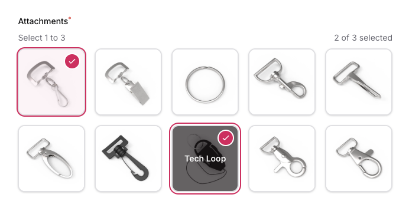

<picture>
   <source media="(prefers-color-scheme: dark)" srcset="docs/header-dark.png">
   
</picture>

[](https://packagist.org/packages/daikazu/filament-image-checkbox-group)
[](https://github.com/daikazu/filament-image-checkbox-group/actions?query=workflow%3Arun-tests+branch%3Amain)
[](https://github.com/daikazu/filament-image-checkbox-group/actions?query=workflow%3A"Fix+PHP+code+style+issues"+branch%3Amain)
[](https://packagist.org/packages/daikazu/filament-image-checkbox-group)

# Filament Image Checkbox Group

A custom form component for FilamentPHP v4 that displays checkbox group options as image-based selectable buttons.



## Features

- Styled as buttons instead of traditional checkboxes
- Contains an image and an optional label for each option
- Allows multiple selections
- Supports `min` and `max` selection constraints
- Optional requirement validation with min/max enforcement
- Emits selected values to Livewire as an array
- Styled options as cards with hover/active states
- Prevents selecting more than max items
- Reusable as a custom form field
- Full keyboard accessibility support

## Installation

You can install the package via composer:

```bash
composer require daikazu/filament-image-checkbox-group
```

### Styling Configuration

if you don't have a theme already, you need to create one. check [Filamentphp Theme](https://filamentphp.com/docs/4.x/styling/overview#creating-a-custom-theme)

after you're done, add the following to your resources/filament/admin/theme.css (depending on your panel)

```css
@source '../../../../vendor/daikazu/filament-image-checkbox-group/resources/views/**/*.blade.php';
```
finally, run ```npm run build```

You can publish the config file with:

```bash
php artisan vendor:publish --tag="filament-image-checkbox-group-config"
```

Optionally, you can publish the views using:

```bash
php artisan vendor:publish --tag="filament-image-checkbox-group-views"
```

## Usage

```php
use Daikazu\FilamentImageCheckboxGroup\Forms\Components\ImageCheckboxGroup;

// In your form schema
ImageCheckboxGroup::make('amenities')
    ->options([
        'wifi' => [
            'label' => 'Wi-Fi',
            'image' => asset('images/amenities/wifi.jpg'),
        ],
        'parking' => [
            'label' => 'Parking',
            'image' => asset('images/amenities/parking.jpg'),
        ],
        'pool' => [
            'label' => 'Swimming Pool',
            'image' => asset('images/amenities/pool.jpg'),
        ],
    ])
    ->required()
```

### Grid Columns Configuration

The component supports two ways to configure the grid layout:

1. Simple integer configuration:
```php
ImageCheckboxGroup::make('amenities')
    ->options([...])
    ->gridColumns(4)  // Will create a responsive grid that grows up to 4 columns
```

2. Detailed responsive configuration:
```php
ImageCheckboxGroup::make('amenities')
    ->options([...])
    ->gridColumns([
        'default' => 1,  // mobile first (xs breakpoint)
        'sm' => 2,       // small screens (640px)
        'md' => 3,       // medium screens (768px)
        'lg' => 4,       // large screens (1024px)
        'xl' => 6,       // extra large screens (1280px)
        '2xl' => 8,      // 2xl screens (1536px)
    ])
```

The responsive configuration supports these breakpoints:
- `default`: Mobile first (< 640px)
- `sm`: Small screens (≥ 640px)
- `md`: Medium screens (≥ 768px)
- `lg`: Large screens (≥ 1024px)
- `xl`: Extra large screens (≥ 1280px)
- `2xl`: 2XL screens (≥ 1536px)

You can specify any combination of breakpoints. Unspecified breakpoints will inherit from the previous breakpoint:
```php
ImageCheckboxGroup::make('amenities')
    ->options([...])
    ->gridColumns([
        'default' => 1,  // 1 column on mobile
        'md' => 3,       // 3 columns from medium screens up
        'xl' => 4,       // 4 columns from extra large screens up
    ])
```

### With Min/Max Selection

```php
ImageCheckboxGroup::make('amenities')
    ->options([
        'wifi' => [
            'label' => 'Wi-Fi',
            'image' => asset('images/amenities/wifi.jpg'),
        ],
        'parking' => [
            'label' => 'Parking',
            'image' => asset('images/amenities/parking.jpg'),
        ],
        'pool' => [
            'label' => 'Swimming Pool',
            'image' => asset('images/amenities/pool.jpg'),
        ],
    ])
    ->minSelect(1) // Must select at least 1
    ->maxSelect(2) // Cannot select more than 2
    ->required()    
```

### Without Images (Label-only buttons)

```php
ImageCheckboxGroup::make('categories')
    ->options([
        'electronics' => 'Electronics',
        'clothing' => 'Clothing',
        'food' => 'Food',
        'books' => 'Books',
    ])
    ->gridColumns(2) // Show in 2 columns
    ->required()
```

### Optional Selection

```php
ImageCheckboxGroup::make('additional_features')
    ->options([
        'feature1' => [
            'label' => 'Feature 1',
            'image' => asset('images/features/feature1.jpg'),
        ],
        'feature2' => [
            'label' => 'Feature 2',
            'image' => asset('images/features/feature2.jpg'),
        ],
    ])
    ->maxSelect(3) // Optional but limited to max 3 selections
```

## Configuration

You can configure default behavior for all instances of this component:

```php
// config/filament-image-checkbox-group.php
return [
    'default_grid_columns' => 4,
    'default_min_select' => null,
    'default_max_select' => null,
];
```

## Customization

### Helper Text

Add helper text to guide users:

```php
ImageCheckboxGroup::make('amenities')
    ->options([...])
    ->helperText('Select the amenities available at this property')
```

## Validation

The component handles validation automatically:

- If the field is marked as `->required()`, it will require at least 1 selection (or the number specified by `->minSelect()`)
- If `->maxSelect()` is set, it will enforce a maximum number of selections
- If the field is not required, no minimum selection validation is applied, but the max limit is still enforced

## Data Format

The component stores an array of selected values in your model:

```php
// Example data in your model
public $amenities = ['wifi', 'pool'];
```

## Examples

### Property Amenities Selection

```php
use Daikazu\FilamentImageCheckboxGroup\Forms\Components\ImageCheckboxGroup;

// In your form schema
Forms\Components\Section::make('Amenities')
    ->description('Select the amenities available at this property')
    ->schema([
        ImageCheckboxGroup::make('amenities')
            ->options([
                'wifi' => [
                    'label' => 'Wi-Fi',
                    'image' => asset('images/amenities/wifi.jpg'),
                ],
                'parking' => [
                    'label' => 'Parking',
                    'image' => asset('images/amenities/parking.jpg'),
                ],
                'pool' => [
                    'label' => 'Swimming Pool',
                    'image' => asset('images/amenities/pool.jpg'),
                ],
                'gym' => [
                    'label' => 'Fitness Center',
                    'image' => asset('images/amenities/gym.jpg'),
                ],
                'spa' => [
                    'label' => 'Spa',
                    'image' => asset('images/amenities/spa.jpg'),
                ],
                'breakfast' => [
                    'label' => 'Breakfast',
                    'image' => asset('images/amenities/breakfast.jpg'),
                ],
                'restaurant' => [
                    'label' => 'Restaurant',
                    'image' => asset('images/amenities/restaurant.jpg'),
                ],
                'laundry' => [
                    'label' => 'Laundry',
                    'image' => asset('images/amenities/laundry.jpg'),
                ],
            ])
            ->minSelect(1)
            ->maxSelect(5)
            ->required()
            ->gridColumns(4)
            ->helperText('Select between 1 and 5 amenities that best describe your property'),
    ]),
```

## Testing

```bash
composer test
```

## Changelog

Please see [CHANGELOG](CHANGELOG.md) for more information on what has changed recently.

## Contributing

Please see [CONTRIBUTING](CONTRIBUTING.md) for details.

## Security Vulnerabilities

Please review [our security policy](../../security/policy) on how to report security vulnerabilities.

## Credits

- [Mike Wall](https://github.com/daikazu)
- [All Contributors](../../contributors)

## License

The MIT License (MIT). Please see [License File](LICENSE.md) for more information.
